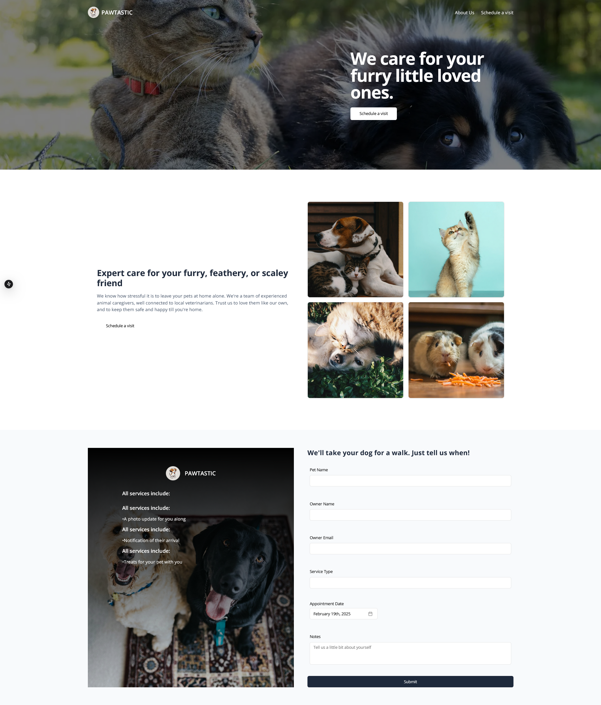

# SVEN - Pet Booking Website



## Prerequisites

- [Docker](https://docs.docker.com/engine/release-notes/27) (engine version 27.2.0 or higher)
- [composer](https://getcomposer.org/download/) (version 2.8.2 or higher)
- [PHP](https://windows.php.net/download#php-8.2) (version 8.2.25 or higher)
- API Testers:
  - [Postman](https://www.postman.com)
  - [Bruno](https://www.usebruno.com/)

## Installation

1. Clone the repository:

   ```bash
   git clone https://github.com/elmoya/SVEN-Web-lorenzmoya-website.git
   cd SVEN-Web-lorenzmoya-website
   ```

2. Install dependencies:

   ```bash
   npm install
   ```

## Running the Application

1. Start the development server:

   ```bash
   npm run dev
   ```

2. Open your browser and navigate to:

   ```bash
   http://localhost:3000/
   ```